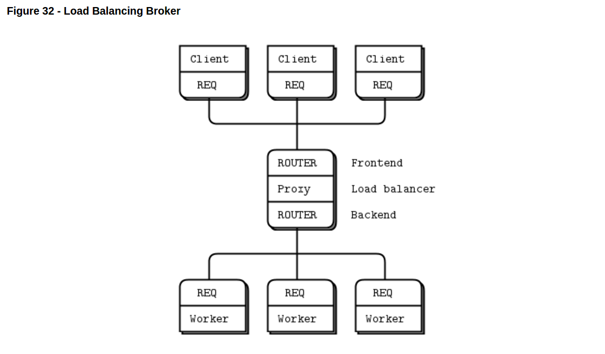

ZeroMQ Examples
==================
from [zeromq official guide](http://zguide.zeromq.org/py:mtserver)

## multi-thread server

[source code](multithread-server/)

## Load Balancing Broker

[source code](load_balancer/)
