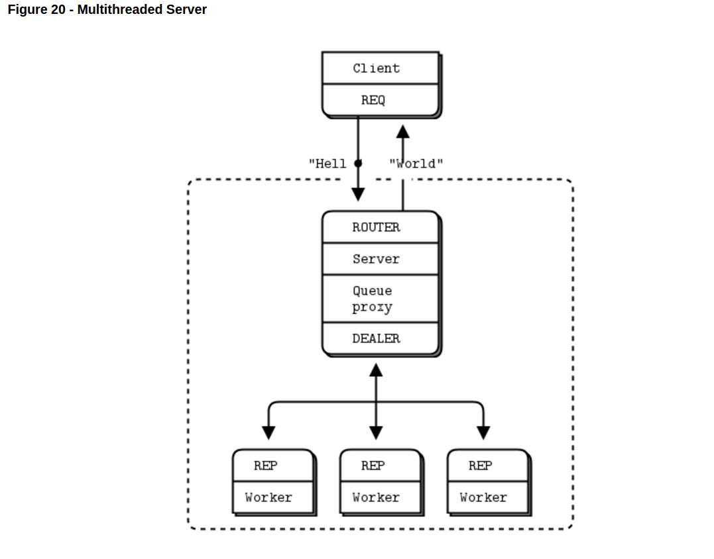
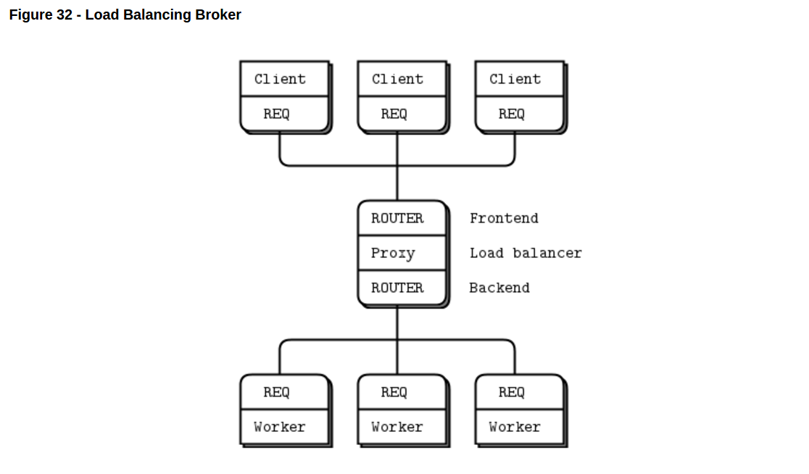
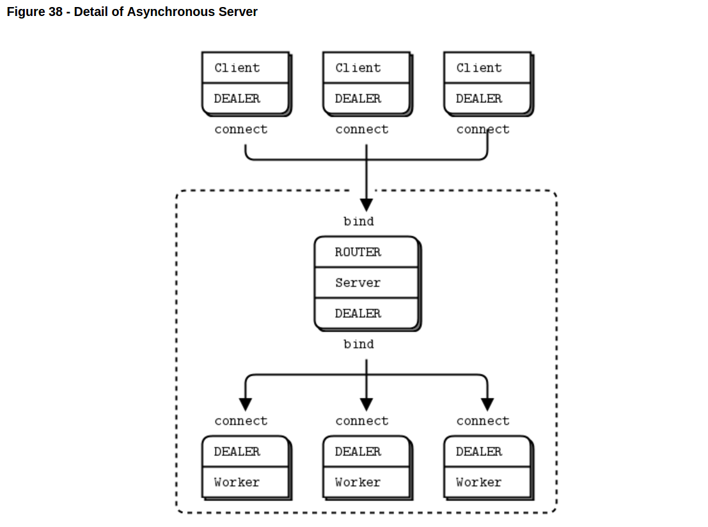
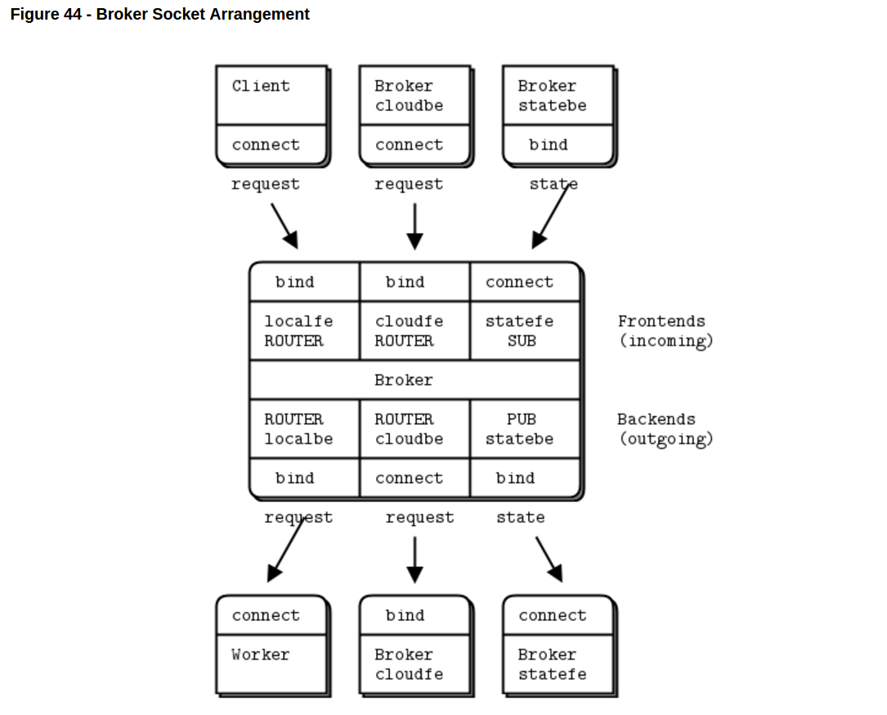

ZeroMQ Examples
==================
from [zeromq official guide](http://zguide.zeromq.org/py:mtserver)

## Multi-Thread Server

[source code](multithread-server/)

## Load Balancing Broker

### Synchronous Clients/Servers

[source code](load_balancer/)

### Asynchronous Clients/Servers

## Cluster Broker

